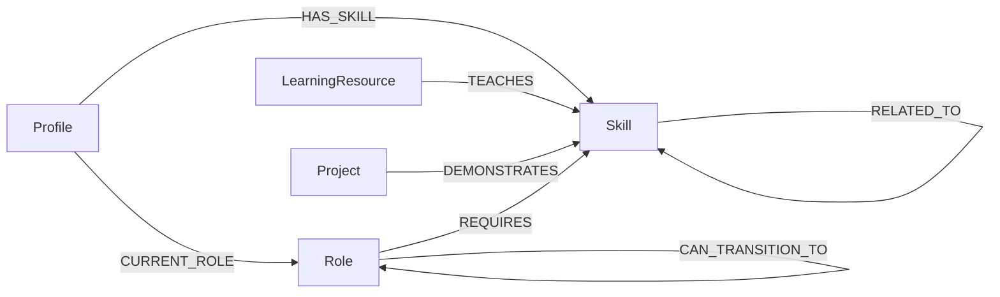

# TalentGraph

TalentGraph is a career mobility explorer that helps students, interns, and developers understand how their current skills can lead to a target role. It models roles, skills, learning resources, portfolio projects, and career transitions as a connected graph in CognoDB.

The primary demo will find up to five paths from a current role to a target role, explain transferable and missing skills at every step, and recommend concrete ways to close each gap.

## Why a graph database?

Career mobility is a traversal problem. A useful answer connects a profile to skills, roles, intermediate transitions, resources, and projects across several hops. CognoDB stores those connections directly and supports bounded variable-length Cypher paths without recursive relational joins.



## Current milestone

The repository currently includes:

- A server-only CognoDB Bolt driver and database health endpoint.
- A deterministic graph dataset generator.
- Validated JSON seed fixtures with stable IDs.
- Idempotent, parameterized CognoDB seed queries.
- A guarded database clear script.
- A responsive `/career-path` explorer with role, skill, and path controls.
- Ranked transition cards with skill-fit scores and expandable learning plans.
- Loading, empty, API error, and retry states for the primary demo flow.
- A responsive `/skill-gap` analyzer with weighted readiness and ranked next skills.
- An interactive `/explorer` powered by Cytoscape.js with filters and node details.
- A bounded graph-neighborhood API capped at 150 nodes and 300 relationships.
- A responsive product landing page that connects the three primary workflows.
- Automated tests for data invariants, service calculations, graph limits, and UI states.

Submission documentation, final responsive QA, and deployment are the next implementation milestones.

## API

The current server API includes:

```text
GET  /api/health
GET  /api/roles?q=<query>
GET  /api/roles/:id
POST /api/career-path
POST /api/skill-gap
GET  /api/graph?roleId=<id>&depth=<1|2>
```

Example career-path request:

```json
{
  "currentRoleId": "frontend-developer",
  "targetRoleId": "ai-engineer",
  "skillIds": ["javascript", "typescript", "react"],
  "maxHops": 4
}
```

The path repository uses a fixed, bounded variable-length traversal. `maxHops` is validated to `1-4` and passed as a query parameter:

```cypher
MATCH path = (current:Role {id: $currentRoleId})
              -[:CAN_TRANSITION_TO*1..4]->
              (target:Role {id: $targetRoleId})
WHERE length(path) <= $maxHops
RETURN nodes(path), relationships(path), length(path)
ORDER BY length(path)
LIMIT 25
```

The service removes cyclic and duplicate candidates, calculates shared and missing skills at each transition, attaches learning resources and projects, and returns at most five paths ordered by hop count and suitability.

Example skill-gap request:

```json
{
  "targetRoleId": "ai-engineer",
  "skillIds": ["python", "rest-apis"]
}
```

The skill-gap service compares the selected skills with the target role's
requirements, calculates an importance-weighted readiness score, separates
essential and optional gaps, and returns up to five next skills with mapped
learning resources and projects.

The graph endpoint starts from a role and follows only the curated relationship
types for one or two hops. The traversal range is fixed in Cypher, while the
validated depth is passed as a parameter:

```cypher
MATCH path = (root:Role {id: $roleId})-[*1..2]-(connected)
WHERE length(path) <= $depth
  AND all(relationship IN relationships(path)
    WHERE type(relationship) IN $relationshipTypes)
RETURN nodes(path), relationships(path), length(path)
ORDER BY length(path)
LIMIT 400
```

The service deduplicates nodes and relationships, preserves relationship
direction, keeps the selected root role, and caps the JSON response before it
reaches Cytoscape.js.

## Dataset

| Entity | Count |
| --- | ---: |
| Roles | 30 |
| Skills | 70 |
| Learning resources | 25 |
| Projects | 20 |
| Synthetic profiles | 5 |

| Relationship | Count |
| --- | ---: |
| `REQUIRES` | 300 |
| `CAN_TRANSITION_TO` | 60 |
| `RELATED_TO` | 90 |
| `TEACHES` | 75 |
| `DEMONSTRATES` | 80 |
| `HAS_SKILL` | 50 |
| `CURRENT_ROLE` | 5 |

## Create a CognoDB Cloud instance

1. Open the [CognoDB Cloud console](https://console.cognodb.com) and create an account or sign in.
2. From the **Instances** page, select **Create**.
3. Enter a descriptive instance name, such as `talent-graph`.
4. Under **Tier**, select **Free ($0)**. CognoDB allows one free instance per workspace. If the console shows that the free instance is already in use, return to the **Instances** page and use that existing instance instead of selecting a paid tier.
5. Select an available region close to the application deployment. Before continuing, check the **Summary** panel and confirm that the selected tier and monthly estimate are both free. The **Shared** tier shown in the console starts at a monthly charge and requires a payment method.
6. Select **Create instance** and wait for provisioning to finish.
7. When CognoDB displays the connection credentials, copy or download them immediately. The generated password is shown only once. The connection details should include:
   - A URI in the form `bolt+s://<instance-id>.databases.cognodb.cloud`.
   - The username `cognodb`.
   - The generated password.
8. Keep the instance running while reviewing or demonstrating the application.

## Local setup

Requirements:

- Node.js 20 or newer.
- A CognoDB instance reachable over Bolt.

Install dependencies and create the local environment file:

```bash
npm install
cp .env.example .env.local
```

On PowerShell, use:

```powershell
Copy-Item .env.example .env.local
```

Configure these server-only values in `.env.local`:

```text
COGNODB_URI=bolt+s://your-instance.databases.cognodb.cloud
COGNODB_USERNAME=cognodb
COGNODB_PASSWORD=replace-me
COGNODB_DATABASE=
```

`COGNODB_DATABASE` is optional. Database variables must never use the `NEXT_PUBLIC_` prefix, and `.env.local` must never be committed.

## Generate, validate, and seed data

The committed JSON files are generated from the curated definitions in `scripts/lib/build-graph-data.ts`.

```bash
npm run generate:data
npm run validate:data
npm run seed
```

The seed command validates every fixture before connecting, creates uniqueness constraints for each node label, and imports nodes and relationships with `UNWIND`, parameters, and `MERGE`. Running it again updates the same stable entities instead of duplicating them.

Database clearing is intentionally guarded:

```bash
npm run db:clear -- --confirm
```

This removes all nodes and relationships from the configured database. Use it only against an instance dedicated to TalentGraph.

## Development and quality checks

```bash
npm run dev
npm run lint
npm test
npm run build
```

The health endpoint is available at `GET /api/health`. It returns `200` when CognoDB is connected and a sanitized `503` response when the database is unreachable.

## Data provenance and limitations

Role and skill names are a small, manually curated synthetic taxonomy inspired by the public [O*NET database](https://www.onetcenter.org/database.html) and [ESCO classification](https://esco.ec.europa.eu/en/classification). Career transitions, importance values, skill levels, projects, and profiles are synthetic judgments created for this take-home demonstration; they are not copied occupational recommendations and should not be treated as hiring or career advice.

Learning-resource URLs point to official provider materials. The generator does not invent URLs for synthetic projects. All profiles are explicitly synthetic and contain no real personal data.

## Technology

- Next.js App Router and TypeScript
- CognoDB Cloud over Bolt with the official Neo4j JavaScript driver
- Zod
- Tailwind CSS and shadcn/ui
- Cytoscape.js
- Vitest and React Testing Library
