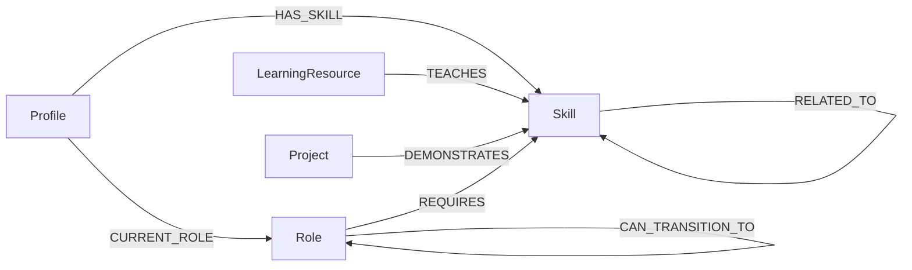

# TalentGraph

TalentGraph is a career mobility explorer that helps students, interns, and developers understand how their current skills can lead to a target role. It models roles, skills, learning resources, portfolio projects, and career transitions as a connected graph in CognoDB.

The primary demo will find up to five paths from a current role to a target role, explain transferable and missing skills at every step, and recommend concrete ways to close each gap.

## Why a graph database?

Career mobility is a traversal problem. A useful answer connects a profile to skills, roles, intermediate transitions, resources, and projects across several hops. CognoDB stores those connections directly and supports bounded variable-length Cypher paths without recursive relational joins.



## Current milestone

The repository currently includes:

- A server-only CognoDB Bolt driver and database health endpoint.
- A deterministic graph dataset generator.
- Validated JSON seed fixtures with stable IDs.
- Idempotent, parameterized CognoDB seed queries.
- A guarded database clear script.
- Automated tests for data invariants and primary demo path coverage.

The career-path, skill-gap, and graph-explorer user interfaces are the next implementation milestones.

## API

The current server API includes:

```text
GET  /api/health
GET  /api/roles?q=<query>
GET  /api/roles/:id
POST /api/career-path
```

Example career-path request:

```json
{
  "currentRoleId": "frontend-developer",
  "targetRoleId": "ai-engineer",
  "skillIds": ["javascript", "typescript", "react"],
  "maxHops": 4
}
```

The path repository uses a fixed, bounded variable-length traversal. `maxHops` is validated to `1-4` and passed as a query parameter:

```cypher
MATCH path = (current:Role {id: $currentRoleId})
              -[:CAN_TRANSITION_TO*1..4]->
              (target:Role {id: $targetRoleId})
WHERE length(path) <= $maxHops
RETURN nodes(path), relationships(path), length(path)
ORDER BY length(path)
LIMIT 25
```

The service removes cyclic and duplicate candidates, calculates shared and missing skills at each transition, attaches learning resources and projects, and returns at most five paths ordered by hop count and suitability.

## Dataset

| Entity | Count |
| --- | ---: |
| Roles | 30 |
| Skills | 70 |
| Learning resources | 25 |
| Projects | 20 |
| Synthetic profiles | 5 |

| Relationship | Count |
| --- | ---: |
| `REQUIRES` | 300 |
| `CAN_TRANSITION_TO` | 60 |
| `RELATED_TO` | 90 |
| `TEACHES` | 75 |
| `DEMONSTRATES` | 80 |
| `HAS_SKILL` | 50 |
| `CURRENT_ROLE` | 5 |

## Local setup

Requirements:

- Node.js 20 or newer.
- A CognoDB instance reachable over Bolt.

Install dependencies and create the local environment file:

```bash
npm install
cp .env.example .env.local
```

On PowerShell, use:

```powershell
Copy-Item .env.example .env.local
```

Configure these server-only values in `.env.local`:

```text
COGNODB_URI=bolt+s://your-instance.databases.cognodb.cloud
COGNODB_USERNAME=cognodb
COGNODB_PASSWORD=replace-me
COGNODB_DATABASE=
```

`COGNODB_DATABASE` is optional. Database variables must never use the `NEXT_PUBLIC_` prefix, and `.env.local` must never be committed.

## Generate, validate, and seed data

The committed JSON files are generated from the curated definitions in `scripts/lib/build-graph-data.ts`.

```bash
npm run generate:data
npm run validate:data
npm run seed
```

The seed command validates every fixture before connecting, creates uniqueness constraints for each node label, and imports nodes and relationships with `UNWIND`, parameters, and `MERGE`. Running it again updates the same stable entities instead of duplicating them.

Database clearing is intentionally guarded:

```bash
npm run db:clear -- --confirm
```

This removes all nodes and relationships from the configured database. Use it only against an instance dedicated to TalentGraph.

## Development and quality checks

```bash
npm run dev
npm run lint
npm test
npm run build
```

The health endpoint is available at `GET /api/health`. It returns `200` when CognoDB is connected and a sanitized `503` response when the database is unreachable.

## Data provenance and limitations

Role and skill names are a small, manually curated synthetic taxonomy inspired by the public [O*NET database](https://www.onetcenter.org/database.html) and [ESCO classification](https://esco.ec.europa.eu/en/classification). Career transitions, importance values, skill levels, projects, and profiles are synthetic judgments created for this take-home demonstration; they are not copied occupational recommendations and should not be treated as hiring or career advice.

Learning-resource URLs point to official provider materials. The generator does not invent URLs for synthetic projects. All profiles are explicitly synthetic and contain no real personal data.

## Technology

- Next.js App Router and TypeScript
- CognoDB Cloud over Bolt with the official Neo4j JavaScript driver
- Zod
- Tailwind CSS and shadcn/ui
- Cytoscape.js
- Vitest and React Testing Library
